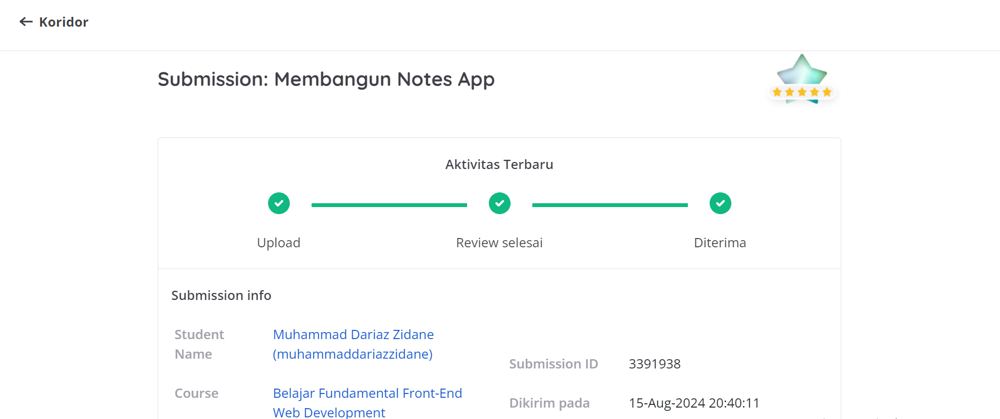

# Membangun Notes App

## Kriteria Submission

### Kriteria Wajib 1: Menampilkan Daftar Catatan dengan Baik ✔

### Kriteria Wajib 2: Formulir Tambah Catatan ✔

### Kriteria Wajib 3: CSS Grid sebagai Metode Layouting ✔

### Kriteria Wajib 4: Bangun Komponen UI dengan Web Component ✔

### Kriteria Opsional 1: Memiliki Tampilan yang Menarik ✔

### Kriteria Opsional 2: Menerapkan Realtime Validation pada Formulir ✔

### Kriteria Opsional 3: Menerapkan Custom Attribute pada Custom Element ✔

### Kriteria Opsional 4: Memiliki Tampilan yang Responsive di Berbagai Perangkat ✔

## Hasil Review

