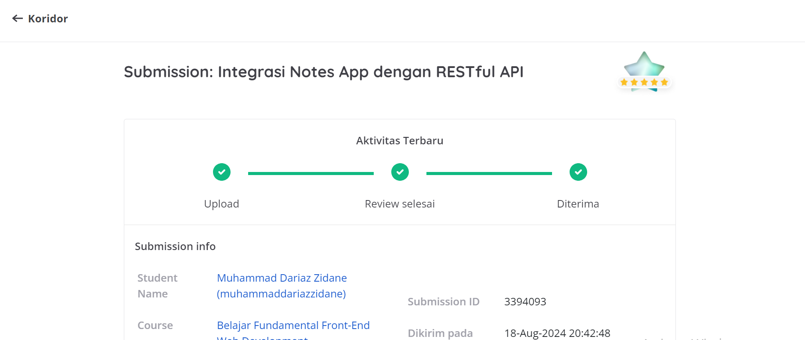

# Integrasi Notes App dengan RESTful API

## Kriteria Submission

### Kriteria Wajib 1: Pertahankan Kriteria Submission Sebelumnya ✔

### Kriteria Wajib 2: Memanfaatkan RESTful API sebagai Sumber Data ✔

### Kriteria Wajib 3: Menggunakan webpack sebagai Module Bundler ✔

### Kriteria Wajib 4: Menggunakan Fetch API ✔

### Kriteria Wajib 5: Memiliki Indikator Loading ✔

### Kriteria Opsional 1: Memiliki Fitur Arsip Catatan ✔

### Kriteria Opsional 2: Menampilkan Feedback Saat Terjadi Error ✔

### Kriteria Opsional 3: Memiliki Efek Pergerakan Halus atau Animasi ✔

### Kriteria Opsional 4: Menerapkan Prettier sebagai Code Formatter ✔

## Hasil Review

